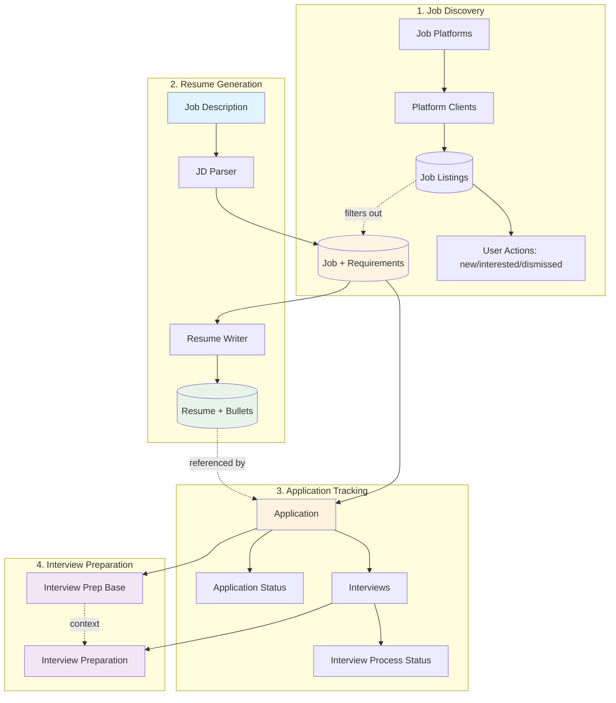
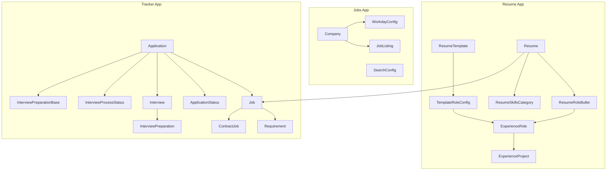

# Job Search Automation Platform - System Design

*An integrated Django application for job discovery, resume generation, application tracking, and interview preparation*

## Overview

The Job Search Automation System is a Django-based platform that automates and streamlines the entire job search lifecycle—from job discovery through resume generation, application tracking, and interview preparation. The system consists of four integrated subsystems:

### 1. Job Discovery & Aggregation
Automates discovery of job postings from company career sites and job boards, aggregating listings from multiple platforms into a unified interface. Tracks user interactions and filters previously applied positions.

**Key capabilities:** Multi-platform fetching, automatic deduplication, user status tracking, search configuration management, location-based filtering, stale job cleanup.

[→ Full Job Discovery Design](./job_discovery_design.md)

### 2. Resume Generation & Logging
Automates creation of role-specific resumes by parsing job descriptions, extracting requirements, and generating targeted experience bullets using LLM.

**Key capabilities:** LLM-driven JD parsing, per-role bullet generation, template-based PDF rendering, bullet editability.

[→ Full Resume Generation Design](./resume_generation_design.md)

### 3. Application Tracking & Metrics
Tracks job applications from submission through final outcome, capturing status transitions and enabling funnel analytics across multiple dimensions.

**Key capabilities:** Application lifecycle tracking, multi-dimensional metrics dashboard, company application history, interview process outcome tracking.

[→ Full Application Tracking Design](./application_tracking_design.md)

### 4. Interview Preparation
Manages interview scheduling and generates structured preparation materials (company context, callback drivers, predicted questions) tailored to each interview stage.

**Key capabilities:** Interview scheduling, LLM-generated preparation documents, dynamic interview-specific content, freeform interview notes.

[→ Full Interview Preparation Design](./interview_preparation_design.md)

### System Integration
These subsystems share a unified data model where `Job` serves as the central entity. Job listings from discovery flow into the application pipeline when user decides to apply. Requirements extracted during parsing inform resume generation. Applications link jobs to their generated resumes. Interviews link applications to preparation documents. This architecture enables end-to-end traceability from job discovery through interview outcomes while maintaining clean separation of concerns across subsystems.

---

## System Architecture



**Data Flow:**
1. **Job Discovery:** Platform APIs → Client Fetch → Job Listings → User Review → Application Decision
2. **Resume Generation:** JD → Job/Requirements → Resume/Bullets → PDF
3. **Application Tracking:** Job → Application → Status/Interviews → Outcomes
4. **Interview Prep:** Application → Base Prep, Interview → Specific Prep

---

## High-Level Directory Structure

```
job_search_automation/
├── job_search_automation/        # Django project settings, URLs, WSGI
├── jobs/                         # Job discovery and aggregation
│   ├── models/                   # JobListing, Company, platform configs
│   ├── clients/                  # Platform API clients (WorkdayClient, etc.)
│   ├── services/                 # JobFetcherService
│   ├── templates/                # Job listings view
│   ├── views/                    # Job listings and interaction endpoints
│   └── management/commands/      # sync_jobs command
├── resume/                       # LLM-based resume generation
│   ├── models/                   # Resume data models
│   ├── prompts/                  # Reusable LLM prompts
│   ├── schemas/                  # Pydantic validation schemas
│   ├── services/                 # ResumeWriter, JDParser
│   ├── clients/                  # ClaudeClient
│   ├── templates/                # HTML/CSS resume templates
│   └── utils/                    # Shared helpers
├── tracker/                      # Job/application logging and analytics
│   ├── models/                   # Job, Application, Interview models
│   ├── schemas/                  # Pydantic schemas for interview prep
│   ├── services/                 # InterviewPrepGenerator
│   ├── prompts/                  # Interview preparation prompts
│   ├── templates/                # View templates
│   └── views/                    # Application and Interview views
├── orchestration/                # CLI orchestration
│   ├── orchestrator.py           # End-to-end resume generation flow
│   └── management/commands/      # Django management commands
├── db.sqlite3
└── manage.py
```

---

## Core Classes

| Class | Responsibility |
|-------|----------------|
| **WorkdayClient** | Handles Workday API pagination and job fetching |
| **JobFetcherService** | Coordinates job fetching across companies and search configurations |
| **ClaudeClient** | Wraps LLM API calls with configuration and token counting |
| **JDParser** | Parses job descriptions into structured requirements |
| **ResumeWriter** | Generates experience bullets and skills via LLM |
| **Orchestrator** | Coordinates end-to-end resume generation workflow |
| **Resume** | Renders resume to PDF via Jinja2 and WeasyPrint |
| **InterviewPrepGenerator** | Generates interview preparation content via LLM |

---

## Functional Requirements Summary

### Job Discovery & Aggregation
Fetches job postings from multiple platforms (Workday, future: Greenhouse, Lever, Ashby), applies location and search-based filtering, tracks user review status (new/interested/dismissed/applied), and automatically marks jobs as applied when found in application tracker.

**User workflow:** Sync jobs via command → Review in web interface → Mark status → Apply to selected jobs

[→ Detailed Requirements](./job_discovery_design.md#functional-requirements)

### Resume Generation & Logging
Parses job descriptions to extract requirements, generates role-tailored experience bullets via LLM, renders professional PDFs using HTML/CSS templates, and persists all data for traceability and analytics.

**User workflow:** Save JD file → Run orchestrator → Review/edit bullets → Re-render if needed → Apply

[→ Detailed Requirements](./resume_generation_design.md#functional-requirements)

### Application Tracking & Metrics
Logs all job applications with metadata, tracks status transitions (callback/rejected/closed), manages interview scheduling, and provides multi-dimensional analytics dashboard for identifying success patterns.

**User workflow:** Create application → Update status → Schedule interviews → Track outcomes → Analyze metrics

[→ Detailed Requirements](./application_tracking_design.md#functional-requirements)

### Interview Preparation
Generates structured preparation materials including company context, callback drivers, background narratives, predicted questions, and interviewer questions, calibrated to interview stage and type.

**User workflow:** Trigger generation command → Review prep documents → Edit as needed → Use during interviews

[→ Detailed Requirements](./interview_preparation_design.md#functional-requirements)

---

## Data Model Organization

Models are distributed across domain-specific Django apps to maintain modularity and enable independent testing/migrations.

| App | Domain | Core Models |
|-----|--------|-------------|
| **jobs** | Job discovery | Company, WorkdayConfig, SearchConfig, JobListing |
| **resume** | Resume generation | ResumeTemplate, TemplateRoleConfig, Resume, ResumeRoleBullet, ResumeSkillsCategory, ExperienceRole, ExperienceProject |
| **tracker** | Application tracking | Job, Requirement, ContractJob, Application, ApplicationStatus, Interview, InterviewProcessStatus, InterviewPreparationBase, InterviewPreparation |

**Cross-app relationships:** Resume references tracker.Job (FK). Applications reference resumes and jobs.

### Models by Domain Diagram



Detailed model schemas available in subsystem design documents.

---

## User-Facing Views

| View | Purpose | Subsystem |
|------|---------|-----------|
| `/jobs/` | Job listings with status filtering | [Job Discovery](./job_discovery_design.md#views) |
| `/applications/<id>/` | Single application detail page | [Application Tracking](./application_tracking_design.md#views) |
| `/applications/<id>/interview-prep/` | Interview preparation materials | [Interview Preparation](./interview_preparation_design.md#views) |
| `/metrics/` | Multi-dimensional application analytics | [Application Tracking](./application_tracking_design.md#views) |
| `/company/<name>/` | Company-specific application history | [Application Tracking](./application_tracking_design.md#views) |
| `/interviews/upcoming/` | Upcoming interviews dashboard | [Interview Preparation](./interview_preparation_design.md#views) |

---

## System-Wide Concerns

### Validation Layer

All LLM outputs undergo **Pydantic schema validation** before persistence to ensure type safety and data integrity.

**Purpose:**
- Guarantee structured data flowing into Django models
- Catch malformed LLM responses early
- Standardize validation logic across services

**Implementation:** Each service defines corresponding schemas (e.g., `JDModel`, `BulletListModel`). Validation occurs immediately after LLM response and before ORM operations.

### LLM Cost Strategy

Cost management is critical due to multi-step pipeline (parsing → bullet generation → interview prep).

**Core principles:**
- Per-role batching for token efficiency
- Short-phrase requirements over full sentences
- Token estimation before every call
- Default to Claude 4.5 Sonnet
- Manual JD preprocessing to exclude irrelevant sections

See [`llm_cost_strategy.md`](./llm_cost_strategy.md) for detailed strategies and pricing breakdowns.

---

## Design Decisions & Tradeoffs

Significant technical tradeoffs and architectural decisions are documented in [`tradeoffs.md`](./tradeoffs.md).

Key decision categories:
- Foundation & Infrastructure (LLM cost management, validation approach, multi-platform integration)
- Job Description Processing (preprocessing, requirement extraction granularity)
- Resume Generation (bullet generation strategy evolution, template technology stack)
- Application Tracking (status modeling, interview outcome tracking)
- Job Discovery (title filtering approach, location configuration)

---

## Incremental Build Plan

| Phase | Focus | Status |
|-------|-------|--------|
| Phase 1-7 | Resume generation core (JD parsing, bullet generation, PDF rendering, orchestration) | ✅ Complete |
| Phase 8 | Application tracking analytics dashboard | ✅ Complete |
| Phase 9 | Interview preparation system | ✅ Complete |
| Phase 10 | Job discovery and aggregation | ✅ Complete |

---

## Future Enhancements

- Batch resume generation for multiple JDs
- Resume feedback analytics (correlate outcomes with resume features)
- General and company-tailored resume modes (target role framing, LP alignment)
- Model flexibility and benchmarking (multi-provider support, per-task model selection)
- Additional job board platforms (Greenhouse, Lever, Ashby, Indeed)