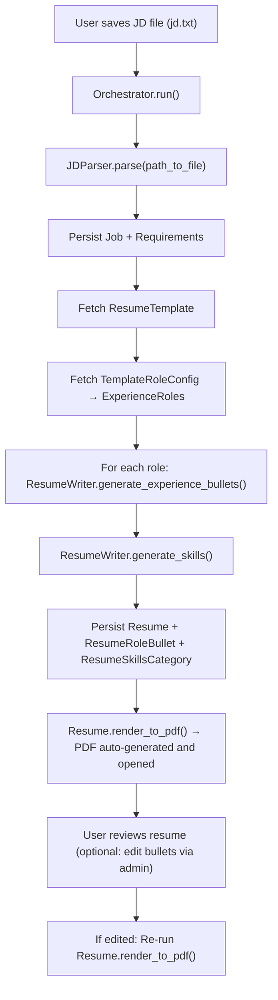

# Resume Generation & Logging - Subsystem Design

*LLM-powered generation of job-tailored resumes with traceability and analytics*

## Overview

The Resume Generation subsystem automates the creation of role-specific resumes by parsing job descriptions, extracting requirements, and generating targeted experience bullets and skills using LLM. Each job description is persisted with its parsed requirements, enabling resume generation to be traced back to source data for analytics and auditing.

---

## Functional Requirements

### JD Ingestion

- Read JD from a local file (e.g., `jd.txt`)
- Normalize and clean text
- Store raw JD text for interview prep and re-parsing

### Requirements & Metadata Extraction

- Make LLM API call via JDParser service
- Extract structured metadata (company, title, role, level, location, work_setting, salary)
- Extract requirements as short phrases with relevance scores
- Validate returned JSON against `JDModel` Pydantic schema
- Persist Job and Requirement records to database

**Output structure:**
```json
{
   "metadata": {
      "company": "Meta",
      "listing_job_title": "Software Engineer",
      "role": "Software Engineer",
      "level": "II",
      "work_setting": "Remote"
   },
   "requirements": [
      {
         "text": "Strong Python skills",
         "keywords": ["Python"], 
         "relevance": 0.9
      }
   ]
}
```

### Bullet Generation Strategy

**Per-role batching approach:**
- One LLM call per experience role (not per requirement)
- Input: all requirements (sorted by relevance) + experience details for one role
- Output: up to N bullets (preconfigured via TemplateRoleConfig)
- Validates bullet responses with Pydantic schemas before ORM persistence

**Benefits:**
- Keeps input well under per-request token limit
- Avoids rate limiting due to fewer calls
- Produces consistent bullet counts and relevance
- Simplifies orchestration while maintaining quality control
- Ensures validated, structured outputs for downstream persistence

### Bullet Source Tracking

**Purpose:** Maintain traceability from resume bullets back to detailed project context for interview preparation.

**Implementation:**
- Each `ResumeRoleBullet` optionally links to source `ExperienceProject` via foreign key
- LLM prompt requires `project_id` in bullet generation responses
- `project_id` validated in `ExperienceBullet` Pydantic schema
- Project ID persisted during bullet creation in orchestrator

**Benefits:**
- Enables downstream interview prep system to fetch full project details (problem context, actions, tools, outcomes)
- Supports preparation for detailed interviewer questions about specific resume bullets
- Maintains audit trail from concise bullet points to comprehensive source data

### Skills Generation

- Single LLM call generates skills organized by category
- Input: all requirements + role context
- Output: JSON with skill categories and items
- Validates against Pydantic schema
- Persists as ResumeSkillsCategory records

### Template Handling

**Technology Stack:** HTML + CSS + Jinja2, rendered to PDF via WeasyPrint

**Template Structure:**
- **Base template** (`base.html`): Static content (name, contact, education) and Jinja2 blocks
- **Child templates** (e.g., `engineer.html`): Extend base with role-specific content
- **CSS stylesheet**: Visual styling (fonts, sizes, spacing, margins)

**Template Selection:**
- Driven by `ResumeTemplate` and `TemplateRoleConfig` rows
- Orchestrator fetches template based on `Job.role` and `Job.level`
- TemplateRoleConfig determines which ExperienceRoles to include and max bullet counts

**Rendering Pipeline:**
1. Orchestrator triggers `Resume.render_to_pdf()`
2. Fetches ResumeTemplate and TemplateRoleConfig entries
3. Queries ResumeRoleBullet and ResumeSkillsCategory objects (excluding items with `exclude=True`)
4. Uses `override_text` if present, otherwise uses `text`
5. Renders HTML template with Jinja2
6. Converts to PDF via WeasyPrint
7. Saves with naming convention: `{company}_{listing_job_title}_{level}.pdf`

**Benefits:**
- Separation of concerns (HTML, CSS, data)
- Maintainable (CSS edits for styling, HTML for structure)
- Reusable (base template eliminates duplication)

### Bullet Editability

**Purpose:** Allow manual refinement of LLM-generated content while preserving original data for analytics

**Fields:**
- `override_text`: TextField for manual edits
- `exclude`: BooleanField to hide bullets from rendering

**Workflow:**
1. LLM generates bullets → stored in `text` field
2. User reviews bullets in Django admin
3. User optionally sets `override_text` for custom wording
4. User optionally sets `exclude=True` to hide bullet
5. Rendering uses `override_text` if present, otherwise `text`, skips excluded bullets
6. If edited, user re-runs `Resume.render_to_pdf()` for updated PDF

---

## Data Models

### Job (tracker app)
| Field | Type | Description |
|-------|------|-------------|
| id | IntegerField | Primary key |
| company | CharField | Company name |
| listing_job_title | CharField | Title from job description |
| role | CharField | Job role |
| specialization | CharField | Optional specialization |
| level | CharField | Level designation |
| location | CharField | Job location |
| work_setting | CharField | Work setting |
| min_experience_years | PositiveIntegerField | Minimum years of experience |
| min_salary | IntegerField | Minimum salary |
| max_salary | IntegerField | Maximum salary |
| external_job_id | CharField | Company-provided job listing ID |
| source | CharField | Origin of job listing |
| raw_jd_text | TextField | Original job description text |

### Requirement (tracker app)
| Field | Type | Description |
|-------|------|-------------|
| id | IntegerField | Primary key |
| job_id | FK(Job) | Source JD |
| text | TextField | Requirement text |
| relevance | FloatField | Relevance score (0–1) |

### ResumeTemplate
| Field | Type | Description |
|-------|------|-------------|
| id | IntegerField | Primary key |
| target_role | CharField | e.g., "Software Engineer" |
| target_level | CharField | e.g., "II" |
| target_specialization | CharField | Optional specialization |
| template_path | CharField | Path to HTML template |
| style_path | CharField | Path to CSS stylesheet |

### TemplateRoleConfig
| Field | Type | Description |
|-------|------|-------------|
| id | IntegerField | Primary key |
| template | FK(ResumeTemplate) | Resume template this config belongs to |
| experience_role | FK(ExperienceRole) | Experience role to include |
| title_override | CharField | Optional title override |
| order | PositiveIntegerField | Display order |
| max_bullet_count | PositiveIntegerField | Max bullets to generate |

### Resume
| Field | Type | Description |
|-------|------|-------------|
| id | IntegerField | Primary key |
| template_id | FK(ResumeTemplate) | Which template was used |
| job_id | OneToOne(Job) | Job description source |

### ResumeRole
| Field | Type | Description |
|-------|------|-------------|
| id | IntegerField | Primary key |
| resume | FK(Resume) | Associated resume |
| experience_role | FK(ExperienceRole) | Original experience role source |
| title | CharField | Frozen title used in resume |
| order | IntegerField | Display order |

### ResumeRoleBullet
| Field | Type | Description |
|-------|------|-------------|
| id | IntegerField | Primary key |
| resume_role | FK(ResumeRole) | Parent role context |
| experience_project | FK(ExperienceProject) | Source project for this bullet (nullable) |
| order | IntegerField | Display order within role |
| text | TextField | Generated bullet text |
| override_text | TextField | Optional manual edit |
| exclude | BooleanField | Whether to exclude from rendering |

### ResumeSkillsCategory
| Field | Type | Description |
|-------|------|-------------|
| id | IntegerField | Primary key |
| resume | FK(Resume) | Associated resume |
| order | IntegerField | Display order |
| category | CharField | Category label |
| skills_text | TextField | CSV string of skills |
| exclude | BooleanField | Whether to exclude from rendering |

### ExperienceRole
| Field | Type | Description |
|-------|------|-------------|
| id | IntegerField | Primary key |
| key | CharField | Stable identifier |
| company | CharField | Employer name |
| title | CharField | Job title |
| start_date | DateField | Role start date |
| end_date | DateField | Role end date |
| location | CharField | Role location |

### ExperienceProject
| Field | Type | Description |
|-------|------|-------------|
| id | IntegerField | Primary key |
| experience_role | FK(ExperienceRole) | Associated role |
| short_name | CharField | Project label |
| problem_context | TextField | Problem statement |
| actions | CharField | CSV action items |
| tools | CharField | CSV tools/technologies |
| outcomes | CharField | CSV outcomes |

---

## Services & Clients

### ClaudeClient

Client responsible for interacting with the LLM provider and enforcing request-level constraints.

**Responsibilities:**
- Execute LLM requests with retry and error handling
- Manage token accounting and enforce token limits
- Apply model and generation configuration defaults
- Parse and validate raw LLM responses

**Exposed interface:**
- Generate model responses given prompts and generation constraints
- Estimate token usage for candidate inputs

---

### JDParser

Service responsible for transforming unstructured job description text into structured, validated data.

**Responsibilities:**
- Construct parsing prompts from raw job description content
- Delegate parsing to the LLM client
- Validate structured output against the canonical job description schema
- Produce normalized, persistence-ready requirement data

**Core workflow:**
- Load job description content
- Invoke LLM-based parsing
- Validate and normalize parsed output
- Return structured job description data

---

### ResumeWriter

Service responsible for generating resume content aligned to role requirements.

**Responsibilities:**
- Generate role-specific experience bullets from requirements and context
- Generate categorized skill sets
- Optimize prompts for token efficiency
- Validate generated content against structured schemas

**Core workflow:**
- Prepare requirement and role context
- Generate experience bullets
- Generate skills grouped by category
- Validate and return structured resume content

---

## Orchestrator

Coordinates end-to-end resume generation workflow.

**Workflow:**
1. Read JD file from disk
2. Call JDParser to extract metadata and requirements
3. Persist Job and Requirement records
4. Fetch ResumeTemplate based on Job.role and Job.level
5. For each TemplateRoleConfig:
   - Call ResumeWriter.generate_experience_bullets()
   - Persist ResumeRoleBullet records
6. Call ResumeWriter.generate_skills()
7. Persist ResumeSkillsCategory records
8. Call Resume.render_to_pdf()
9. Open generated PDF

**Command-line interface:**
```bash
python manage.py run_orchestrator /path/to/jd.txt
```

---

## End-to-End Flow



---

## User Workflow

1. **Save JD to file** (e.g., `jd.txt`)
   - Manually preprocess to remove irrelevant sections (benefits, culture, etc.)

2. **Run orchestrator:**
   ```bash
   python manage.py run_orchestrator jd.txt
   ```

3. **Review auto-generated PDF** (opens automatically)

4. **Optional: Edit bullets in Django admin**
   - Navigate to Resume → ResumeRoleBullets
   - Set `override_text` for custom wording
   - Set `exclude=True` to hide bullets

5. **If edited: Re-render PDF** via Django admin action on Resume record

6. **Apply to job** using generated resume

7. **Create Application record** in tracker subsystem

---

## Integration with Other Subsystems

### Job Discovery Integration

- Job listings from discovery subsystem can inform which JDs to download
- User identifies interesting jobs via `/jobs/` view
- Copies job posting content to local file for resume generation

### Application Tracking Integration

- Generated Resume links to Job via OneToOne relationship
- Application records reference both Job and Resume
- Enables traceability from JD → Resume → Application → Outcome

---

## Future Enhancements

- Batch generation for multiple JDs
- General target role resume (generate without specific JD)
- Company-tailored resume modes (align with LPs, values)
- Resume feedback analytics (correlate outcomes with resume features)
- Model flexibility (per-task model selection, benchmarking)