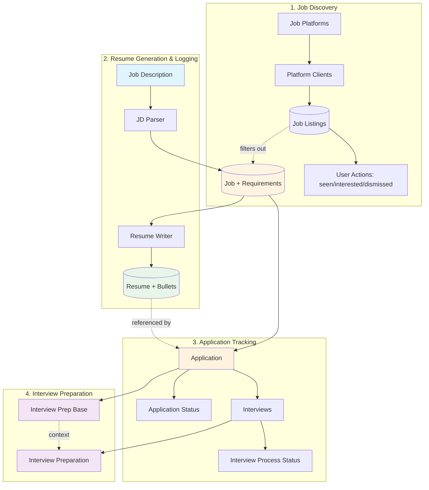
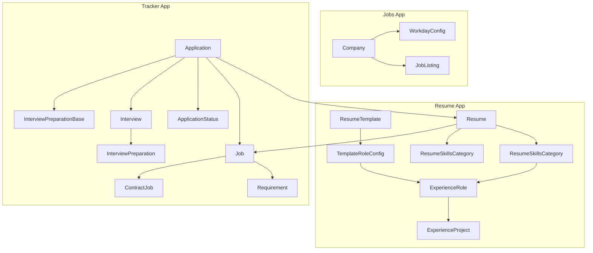
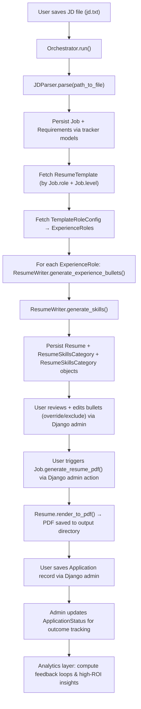

# Job Search Automation Platform - System Design

*An integrated Django application for job discovery, resume generation, application tracking, and interview preparation*

## Overview

The Job Search Automation System is a Django-based platform that automates and streamlines the entire job search lifecycle—from job discovery through resume generation, application tracking, and interview preparation. The system consists of four integrated subsystems:

### 1. Job Discovery & Aggregation
Automates discovery of job postings from company career sites and job boards, aggregating listings from multiple platforms (Workday, Greenhouse, Lever, Indeed) into a unified interface. Tracks user interactions (seen/interested/dismissed) and filters out previously applied positions to surface only new, relevant opportunities.

**Key capabilities:**
- Multi-platform job fetching via extensible client architecture
- Automatic deduplication against applied jobs from tracker system
- User status tracking (new, interested, dismissed, applied)
- Search configuration management (search terms with role-specific exclusions via SearchConfig model)
- Location-based filtering using platform-specific location IDs
- Stale job detection and cleanup (jobs no longer appearing in API results)
- Batch syncing via management command with keyword/location filters

### 2. Job-Tailored Resume Generation & Logging
Automates the creation of role-specific resumes by parsing job descriptions, extracting requirements, and generating targeted experience bullets and skills using LLM. Each job description is persisted with its parsed requirements, enabling resume generation to be traced back to source data for analytics and auditing.

**Key capabilities:**
- LLM-driven parsing of job descriptions into structured requirements
- Per-role bullet generation optimized for token efficiency
- Template-based PDF rendering with precise typography control
- Resume versioning and bullet editability (override/exclude)

### 3. Application Tracking & Metrics
Tracks job applications from submission through final outcome, capturing status transitions (callbacks, rejections, closures) and enabling funnel analytics. Provides dimensional analysis across role, location, salary, and other attributes to identify success patterns.

**Key capabilities:**
- Application lifecycle tracking with timestamped status events
- Multi-dimensional metrics dashboard (callback rates, rejection patterns, trends)
- Company application history for avoiding duplicate applications
- Interview process outcome tracking (offers, rejections, withdrawals)

### 4. Interview Tracking & Preparation
Manages interview scheduling and generates structured preparation materials (company context, callback drivers, background narratives, predicted questions) tailored to each interview stage. Preparation documents are dynamically rendered based on interview type (recruiter/technical/hiring manager).

**Key capabilities:**
- Interview scheduling with stage/focus/format tracking
- LLM-generated preparation documents with markdown formatting
- Dynamic view with interview dropdown for stage-specific content
- Freeform interview notes integrated with application timeline

### System Integration
These subsystems share a unified data model where `Job` serves as the central entity. Job listings from discovery flow into the application pipeline when user decides to apply. Requirements extracted during parsing inform resume generation. Applications link jobs to their generated resumes. Interviews link applications to preparation documents. This architecture enables end-to-end traceability from job discovery through interview outcomes while maintaining clean separation of concerns across subsystems.

## System Architecture


**Data Flow:**
1. **Job Discovery:** Platform APIs → Client Fetch → Job Listings → User Review → Application
2. **Resume Generation:** JD → Job/Requirements → Resume/Bullets → PDF
3. **Application Tracking:** Job → Application → Status/Interviews → Outcomes
4. **Interview Prep:** Application → Base Prep, Interview → Specific Prep

---

## High-Level Directory Structure

```
job_search_automation/ (Django Project)
├── job_search_automation/        # Django project settings, URLs, WSGI
├── resume/                       # LLM-based resume generation app
│   ├── models/                   # Models for persisting resume data
│   ├── prompts/                  # Reusable and versioned LLM prompts
│   ├── schemas/                  # Pydantic schemas for validating all LLM outputs
│   ├── services/                 # ResumeWriter, JDParser
│   ├── clients/                  # External API clients (ClaudeClient)
│   ├── templates/                # HTML templates per role
│   └── utils/                    # Shared helpers for the app (prompt manipulation, validation, content builders)
├── tracker/                      # Job/application logging and analytics
│   ├── models/                   # Models for persisting job, application, and interview prep data
│   ├── schemas/                  # Pydantic schemas for interview prep validation
│   ├── services/                 # InterviewPrepGenerator
│   ├── prompts/                  # Interview preparation prompts
│   ├── templates/                # HTML templates for views
│   ├── views/                    # Application and Interview views
├── jobs/                         # Job discovery and aggregation
│   ├── models/                   # JobListing, Company, platform configs
│   ├── clients/                  # Platform API clients (WorkdayClient, etc.)
│   ├── services/                 # JobFetcherService
│   ├── templates/                # Job listings view
│   ├── views/                    # Job listings and interaction endpoints
│   └── management/commands/      # sync_jobs command
├── orchestration/                # CLI / orchestration entrypoints (management commands or scripts)
│   ├── orchestrator.py           # thin Orchestrator that imports resume + tracker logic and runs end-to-end
│   ├── management/commands/      # CLI commands / Django commands (run_orchestrator.py)
├── db.sqlite3                    # Local data store
└── manage.py
```

---

## Core Classes and Responsibilities

| Class | Responsibility |
|-------|----------------|
| **ClaudeClient** | Wraps LLM API calls (`generate()`, `count_tokens()`), handles configuration and model defaults. |
| **WorkdayClient** | Handles Workday API pagination, location filtering, and job fetching. Applies seniority filters and returns normalized job data. |
| **JobFetcherService** | Coordinates job fetching across multiple companies/platforms and search configurations. Applies search-specific title exclusions (via SearchConfig), syncs results to database, marks stale jobs, and automatically sets status=APPLIED for jobs found in tracker.Job (scoped by company). |
| **ResumeWriter** | Handles LLM-driven **bullet generation** for a given experience role and requirements; includes `generate_experience_bullets()` and `generate_skills()` to produce both experience and skill-section entries used by `Resume` rendering. |
| **JDParser (JDParser)** | Parses JD text → extracts requirements and metadata (JSON). |
| **Orchestrator** | Orchestrator CLI/entrypoint: invokes JDParser, calls ResumeWriter for bullets, persists Job/Requirement/Resume/ResumeBullet via tracker models, and manages iterative flows. |
| **Job (model methods)** | `generate_resume_pdf()` — entry point for on-demand PDF generation via Django admin; delegates to `Resume.render_to_pdf()` for actual rendering. |
| **Resume (model methods)** | `render_to_pdf()` — assembles template with bullets and skills, renders HTML via Jinja2, converts to PDF via WeasyPrint. |
| **InterviewPrepGenerator** | Coordinates generation of interview preparation content via LLM; handles both base preparation (company context, drivers, narrative) and interview-specific preparation (predicted questions, interviewer questions). |

---

## Functional Requirements

### Job Discovery & Aggregation

The system fetches job postings from multiple platforms and aggregates them into a unified review interface.

#### Platform Support
- **Workday**: Primary enterprise ATS platform (Nordstrom, Boeing, etc.)
- **Future platforms**: Greenhouse, Lever, Ashby, Indeed (extensible architecture)

#### Company Configuration
- Company model stores platform type and active status
- Platform-specific config models (WorkdayConfig, etc.) store API endpoints and location filters
- Factory method `Company.get_job_fetcher()` returns appropriate client based on platform

#### Syncing Process
1. **Client initialization**: Platform client created from company config
3. **Search-based filtering**: Applies location filters and search-specific title exclusions (configured via SearchConfig model)
4. **Normalization**: Returns standardized job dict format across platforms
5. **Applied job detection**: Checks fetched jobs against tracker.Job records for the company and marks matching jobs as APPLIED
6. **Syncing**: Updates database via `update_or_create`, tracking `last_fetched` timestamps
7. **Stale detection**: Jobs not in current fetch marked as `is_stale=True`
8. **Cleanup**: Stale jobs older than 30 days automatically deleted

#### Deduplication
- During sync, fetched jobs are checked against `tracker.Job.external_job_id` (scoped to company)
- Jobs found in tracker are automatically set to `status=APPLIED` in JobListing
- This prevents duplicate applications and maintains consistency across views
- Applied jobs are excluded from default view but visible when filtering by "Applied" status

#### Status Management
Job listings track their review state through a single `status` field with four possible values:

- **NEW**: Default state for all fetched jobs (unless already applied via tracker.Job)
- **INTERESTED**: User has flagged job for potential application
- **DISMISSED**: User has rejected job as not a fit
- **APPLIED**: Job was found in tracker.Job during sync (user already applied)

Status transitions are managed through:
1. **Automatic sync detection**: JobFetcherService sets status=APPLIED for jobs matching tracker.Job records
2. **User actions**: View provides controls to transition between NEW → INTERESTED → APPLIED or NEW → DISMISSED
3. **Immutable applied status**: Once marked APPLIED (either via sync or user action), jobs maintain this status

#### Search Configuration Management
Job filtering is configured per search term via the SearchConfig model:

- Each active SearchConfig defines a search term (e.g., "Software Engineer", "Data Analyst")
- Each config can specify exclusion terms (e.g., ["Senior", "Staff", "Principal"])
- Exclusion logic is handled in JobFetcherService after fetching, not in platform clients
- Configuration is managed via Django admin without code changes
- New search terms can be added dynamically without modifying code

**Service behavior:**
- When `keywords` parameter is provided, syncs only SearchConfigs where search_term contains the keyword
- When `keywords` is omitted, syncs all active SearchConfigs
- This enables both exploratory searches and standardized role-based syncing

**Example configurations:**
- SearchConfig(search_term="Software Engineer", exclude_terms=["Staff", "Principal", "Frontend"])
- SearchConfig(search_term="Data Analyst", exclude_terms=[])
- SearchConfig(search_term="Business Intelligence Engineer", exclude_terms=["Director", "Manager"])

This design allows flexible search exploration while maintaining role-specific filtering rules.

#### User Workflow
1. Run sync command: `python manage.py sync_jobs --keywords engineer --location Seattle` (filters to search configs containing "engineer", or omit --keywords to sync all active configs)
2. Visit `/jobs/` to see new listings (default filter: `status=NEW`)
3. Review each job and update status:
   - Mark as **INTERESTED** to flag for potential application
   - Mark as **DISMISSED** to hide permanently
   - Bulk action: "Mark All as Dismissed" for remaining new jobs
4. Switch to interested view (`status=INTERESTED`) to see flagged jobs
5. Apply to jobs, then mark as **APPLIED** to remove from interested view
6. Bulk action: "Mark All as Applied" for remaining interested jobs
7. Next sync only shows NEW jobs that haven't been reviewed

### JD Ingestion
- Read JD from a local file (e.g., `jd.txt`).
- Normalize and clean text.

### Requirements & Metadata Extraction
- Make LLM API call.
- Return structured JSON:
- **Validate the returned JSON against the `JDModel` Pydantic schema** to ensure the response adheres to expected types and structure before persisting to the database. Any validation failure halts the flow and surfaces a descriptive error.


```
{
   "metadata": {
      "company": "Meta",
      "listing_job_title": "Software Engineer",
      "role": "Software Engineer",
      "work_setting": "Remote"
   },
   "requirements": [
         {
            "text": "Strong Python skills",
            "keywords": ["Python"], 
            "relevance": 0.9
         }
   ]
}
```

### Template Handling

**Technology Stack:**  
Resume templates use **HTML + CSS + Jinja2**, rendered to PDF via **WeasyPrint**.

**Rationale:**  
- **HTML + CSS** provides precise control over typography (font family, sizes, bold, spacing) required for professional resume formatting.  
- **Jinja2** enables template inheritance and variable substitution, supporting DRY principles (base template for static content, child templates for variations).  
- **WeasyPrint** reliably converts HTML + CSS to PDF with predictable rendering.

**Template Structure:**  
- **Base template** (`base.html`): Contains static content (name, contact info, education) and defines Jinja2 blocks for dynamic sections (experience, skills).  
- **Child templates** (e.g., `engineer.html`): Extend base template and override blocks with role-specific content.  
- **CSS stylesheet** (`resume.css`): Defines all visual styling (Calibri font, 20pt name, 14pt section headers, 12pt experience titles, 11pt bullets, spacing, margins).

**Template Selection:**  
- Template selection is driven by `ResumeTemplate` + the `TemplateRoleConfig` rows.  
- Use `template.role_configs.filter().order_by("order")` to determine which `ExperienceRole`s to include and the configured `max_bullet_count` per role.  
- The orchestrator fetches the appropriate HTML template based on `Job.role` and `Job.level`, then renders it with Jinja2 using data from `Resume`, `ResumeSkillsCategory`, and `ResumeSkillsCategory` models.

**Rendering Pipeline:**  
1. User triggers PDF generation via Django admin action on a `Job` record.
2. `Job.generate_resume_pdf()` fetches associated `Resume` and delegates to `Resume.render_to_pdf()`.
3. `Resume.render_to_pdf()` fetches `ResumeTemplate` and associated `TemplateRoleConfig` entries.
4. Query `ResumeSkillsCategory` and `ResumeSkillsCategory` objects (filtered by `exclude=False`), using `override_text` if present, otherwise `text`.
5. Render HTML template with Jinja2, injecting roles (using `title_override` if present), bullets and skills.
6. Pass rendered HTML + CSS to WeasyPrint for PDF generation.
7. Save output file with naming convention based on job details (e.g., `{company}_{listing_job_title}_{level}.pdf`).

**Template Directory Structure:**  
```
resume/
  templates/
    html/
      base.html                      # Base template with static content
      analyst.html                   # Child template for analyst roles
      engineer.html                  # Child template for engineer roles
    css/
      compact.css                    # Stylesheet with compact properties
      standard.css                   # Stylesheet with standard properties
```

**Benefits:**  
- **Separation of concerns:** Content (HTML), style (CSS), and data (models) are cleanly separated.  
- **Maintainability:** Changes to styling require only CSS edits; structural changes are isolated to HTML templates.  
- **Reusability:** Base template eliminates duplication of static content across role-specific templates. 

### Bullet Generation

#### Previous (Complex) Design
- One LLM call per requirement.
- Shared state between calls to maintain context.
- Complex pruning, deduplication, and weighted scoring.
- Token-heavy and required rate limiting.

#### Current (Simplified Per-Role) Design
- One LLM call per **experience role**, not per requirement.
- Input: all requirements (sorted by relevance) + experience details for one role.
- Output: up to *N* bullets (preconfigured) for that role.
- **All bullet-generation responses are also validated with Pydantic models** before any ORM persistence, ensuring schema correctness and safe downstream usage.

This approach:
- Keeps input well under the per-request token limit.
- Avoids rate limiting due to fewer calls.
- Produces consistent bullet counts and relevance.
- Simplifies orchestration while maintaining strong quality control.
- Ensures validated, structured outputs for downstream persistence.

### Output Generation
- Generate PDF on-demand via Django admin action.
- Trigger PDF generation through `Job.generate_resume_pdf()`.
- Maintain versioning.

### Application Logging
- Store JD metadata, extracted requirements, and generated resume info.
- Validate and persist via Django ORM.

### Interview Preparation Generation

The system generates structured interview preparation documents to support interview readiness.

#### Base Preparation (Once per Application)
Generated when an application has scheduled interviews:
- Formatted job description with bolded callback drivers
- Company and product context
- Primary callback drivers (1-3 key screening signals)
- Targeted background narrative (opening, core, forward hook)

#### Interview-Specific Preparation (Per Interview)
Generated for each scheduled interview:
- 3-5 predicted questions with structured STAR responses
- 5 interviewer-aligned questions with strategic rationale
- Calibrated to interview stage (recruiter/technical/hiring manager)

#### Generation Approach
- **Single prompt for base preparation:** Generates all base content in one LLM call (formatted JD, company context, drivers, narrative)
- **Single prompt per interview type:** Generates predicted questions and interviewer questions based on stage/focus
- **Markdown output format:** All LLM outputs are markdown-formatted for direct persistence
- **Pydantic validation:** JSON responses are validated before persistence to ensure schema compliance

#### User Workflow
1. User triggers generation via Django admin command
2. System generates `InterviewPreparationBase` for the application
3. System generates `InterviewPreparation` for each scheduled interview
4. User reviews preparation documents via custom view (filtered by interview)
5. User can manually edit markdown fields in Django admin if needed

---

## Validation Layer

All LLM outputs—whether from **JDParser** (requirements extraction) or **ResumeWriter** (bullet generation)—undergo **schema validation via Pydantic** before any persistence or downstream processing.

### Purpose
- Guarantee structured and type-safe data flowing into the Django model layer.
- Catch malformed or incomplete LLM responses early, with clear developer-facing error messages.
- Standardize validation logic across all services interacting with the LLM.

### Implementation Summary
- Each LLM service defines its corresponding Pydantic schema (e.g., `JDModel`, `BulletListModel`).
- Validation occurs immediately after receiving LLM output and before ORM operations.
- Validation failures raise descriptive exceptions to prevent silent data corruption or inconsistent states.

This validation step is mandatory across all LLM-integrated modules.

---

## LLM Cost Strategy

LLM cost management is a core part of the system's architecture due to the multi-step pipeline (parsing → generation).  
Rather than embedding all details in this design document, a dedicated reference is provided in [`llm_cost_strategy.md`](./llm_cost_strategy.md).

At a high level, the system's **cost control principles** are:
- Use **per-role batching** for predictable and token-efficient bullet generation.
- Express requirements as **short phrases** instead of full sentences.
- Estimate and log token usage before every call using `ClaudeClient.count_tokens()`.
- Default to **Claude 4.5 Sonnet**, with optional support for cheaper models for auxiliary tasks.
- Manually preprocess JDs to exclude irrelevant sections for reduced input size.

For detailed strategies, pricing breakdowns, and future optimization levers, see **`llm_cost_strategy.md`**.

---

## Data Model Design

### App and Model Organization

To maintain modularity between the resume-generation domain and the job-tracking domain, models are distributed across **domain-specific Django apps** rather than centralized in one location. This structure supports future growth (e.g., adding analytics or orchestration apps) without creating coupling between unrelated domains.

| App | Domain | Core Models | Responsibility |
|------|---------|--------------|----------------|
| **jobs** | Job discovery | `Company`, `WorkdayConfig`, `JobListing` | Fetches and aggregates job postings from multiple platforms with user interaction tracking. |
| **resume** | Resume generation | `ResumeTemplate`, `TemplateRoleConfig`, `Resume`, `ResumeSkillsCategory`, `ResumeRoleBullet`, `ExperienceRole`, `ExperienceProject` | Manages templates, experience data, and generated resume artifacts. |
| **tracker** | Job and application tracking | `Job`, `Requirement`, `ContractJob`, `Application`, `ApplicationStatus`, `Interview`, `InterviewPreparationBase`, `InterviewPreparation` | Manages job postings, parsed requirements, applications, status updates, and interview preparation. |

**Rationale:**
- Keeps resume logic independent from job tracking logic.
- Enables modular testing and database migrations.
- Supports clean orchestration via `Orchestrator`, which coordinates both domains.
- Allows new domain apps (e.g., analytics, orchestration) to be added without refactoring existing models.

**Cross-App Relationships:**
- The `Resume` model references `tracker.Job` (via FK) since resumes are generated for specific jobs.
- Cross-app foreign keys are defined using the `app_label.ModelName` convention, e.g.:

    ```python
    job = models.ForeignKey("tracker.Job", on_delete=models.CASCADE)
    ```

**Model Organization:**
Each app uses a `models/` directory instead of a single `models.py` file, improving maintainability and clarity as the model layer expands.

```
resume/
  models/
    resume.py
    resume_role_bullet.py
    resume_skills_category.py
    resume_template.py
    experience_role.py
    template_role_config.py

tracker/
  models/
    job.py
    requirement.py
    application.py
    application_status.py
```

Each directory includes an `__init__.py` file that imports all model classes, enabling simple imports throughout the codebase (e.g., `from resume.models import Resume`).

### Models by Domain Diagram


### Core Models

#### Job
| Field | Type | Description |
|--------|------|-------------|
| id | IntegerField | Primary key |
| company | CharField | Company name |
| listing_job_title | CharField | Title from job description |
| role | CharField | Job role |
| specialization | CharField | Optional specialization |
| level | CharField | Level designation |
| location | CharField | Job location |
| work_setting | CharField | Work setting |
| min_experience_years | PositiveIntegerField | Minimum years of experience |
| min_salary | IntegerField | Minimum salary |
| max_salary | IntegerField | Maximum salary |
| external_job_id | CharField | Company-provided job listing ID |
| source | CharField | Origin of job listing (linkedin, company_site, indeed) |
| raw_jd_text | TextField | Original job description text (stored for interview prep and re-parsing) |

#### ContractJob
| Field | Type | Description |
|-------|------|-------------|
| id | int | Primary key |
| job_id | OneToOne(Job) | Base job this contract role is associated with |
| consulting_company | CharField | Optional consulting company through which the contract is offered |
| contract_length_months | PositiveIntegerField | Duration of the contract in months |
| hourly_rate | FloatField | Hourly pay rate for the contract |
| provides_benefits | BooleanField | Whether the contract provides benefits |
| provides_pto | BooleanField | Whether the contract provides paid time off |

#### Requirement
| Field | Type | Description |
|--------|------|-------------|
| id | IntegerField | Primary key |
| job_id | FK(Job) | Source JD |
| text | TextField | Requirement text |
| relevance | FloatField | Relevance score (0–1, higher means more important) |

#### ResumeTemplate
| Field | Type | Description |
|--------|------|-------------|
| id | IntegerField | Primary key |
| target_role | CharField | e.g., "Software Engineer" |
| target_level | CharField | e.g., "II" |
| target_specialization | CharField | Optional specialization (e.g., "Backend", "Python") |
| template_path | CharField | Path to HTML template |
| style_path | CharField | Path to CSS stylesheet |

#### Resume
| Field | Type | Description |
|--------|------|-------------|
| id | IntegerField | Primary key |
| template_id | FK(ResumeTemplate) | Which template was used |
| job_id | OneToOne(Job) | Job description source |

#### ResumeRole
| Field | Type | Description |
|--------|------|-------------|
| id | IntegerField | Primary key |
| resume | FK(Resume) | Associated resume |
| experience_role | FK(ExperienceRole) | Original experience role used as source |
| title | CharField | Frozen title used in this resume (copied from override_title or experience_role.title) |
| order | IntegerField | Display order of this role within the resume |

#### ResumeRoleBullet
| Field | Type | Description |
|--------|------|-------------|
| id | IntegerField | Primary key |
| resume_role | FK(ResumeRole) | Parent role context |
| order | IntegerField | Display order within the role |
| text | TextField | Generated bullet text |
| override_text | TextField | Optional manual edit overriding `text` |
| exclude | BooleanField | Whether to exclude from rendering |

#### ResumeSkillsCategory
| Field | Type | Description |
|--------|------|-------------|
| id | IntegerField | Primary key |
| resume | FK(Resume) | Associated resume |
| order | IntegerField | Display order within the resume |
| category | CharField | Category label such as "Programming Languages" or "Data & Visualization" |
| skills_text | TextField | CSV string of related skills (e.g., "Python, Java") |
| exclude | BooleanField | Whether to exclude from rendering |

#### ExperienceRole
| Field | Type | Description |
|--------|------|-------------|
| id | IntegerField | Primary key |
| key | CharField | Stable identifier used by templates (e.g., "navit_swe", "amazon_sde") |
| company | CharField | Employer name (e.g., "Nav.it") |
| title | CharField | Job title (e.g., "Software Engineer") |
| start_date | DateField | The date the role began |
| end_date | DateField | The date the role ended |
| location | CharField | Location where the role was set in. (e.g "Seattle, WA", "Remote") |

#### ExperienceProject
| Field | Type | Description |
|--------|------|-------------|
| id | IntegerField | Primary key |
| experience_role | FK(ExperienceRole) | Associated role |
| short_name | CharField | Short label for the project/task |
| problem_context | TextField | Short problem statement (concise) |
| actions | CharField | CSV string of action items (e.g., "implemented X, rewrote Y") |
| tools | CharField | CSV string of tools/technologies (e.g., "Django,Postgres") |
| outcomes | CharField | CSV string of short outcomes (e.g., "reduced latency 80%") |

#### TemplateRoleConfig
| Field | Type | Description |
|--------|------|-------------|
| id | IntegerField | Primary key |
| template | FK(ResumeTemplate) | The resume template this configuration belongs to |
| experience_role | FK(ExperienceRole) | The experience role to include in the template |
| title_override | CharField | Optional experience role title override |
| order | PositiveIntegerField | Display order for this role within the template (lower values appear first) |
| max_bullet_count | PositiveIntegerField | Maximum number of bullets to generate for this role |

#### Application
| Field | Type | Description |
|--------|------|-------------|
| id | IntegerField | Primary key |
| applied_date | DateField | When application was submitted |
| job_id | OneToOne(Job) | Job applied to |

#### ApplicationStatus
| Field | Type | Description |
|--------|------|-------------|
| id | IntegerField | Primary key |
| state | CharField | Application state (e.g., rejected, callback, closed, etc.) |
| application_id | OneToOne(Application) | Associated application |
| status_date | DateField | When the event occurred or was recorded |

#### Interview
| Field | Type | Description |
|--------|------|-------------|
| id | IntegerField | Primary key |
| application | FK(Application) | Associated application |
| stage | CharField | Interview stage (recruiter_screen, technical_screen, final_loop) |
| format | CharField | Interview format (phone_call, virtual_meeting) - optional |
| focus | CharField | Interview focus area (coding, system_design, behavioral, hiring_manager) - optional |
| interviewer_name | CharField | Name of the interviewer - optional |
| interviewer_title | CharField | Title/role of the interviewer - optional |
| scheduled_at | DateTimeField | When the interview is scheduled |

#### InterviewProcessStatus
| Field | Type | Description |
|--------|------|-------------|
| id | IntegerField | Primary key |
| application | OneToOne(Application) | Associated application (only exists if interviews happened) |
| outcome | CharField | Final interview outcome (offer, rejected, failed, ghosted, withdrew) |
| outcome_date | DateField | When the outcome occurred or was recorded |
| notes | TextField | Optional context about the outcome |

### Interview Preparation Models

The interview preparation system generates structured preparation documents for interviews, consisting of base analysis (generated once per application) and interview-specific content (generated per interview).

#### InterviewPreparationBase
| Field | Type | Description |
|-------|------|-------------|
| id | IntegerField | Primary key |
| application | OneToOne(Application) | Associated application |
| formatted_jd | TextField | Markdown-formatted job description with bolded callback drivers |
| company_context | TextField | Company product info, mission, team context (markdown) |
| primary_drivers | TextField | 1-3 key resume screening signals with justifications (markdown) |
| background_narrative | TextField | Opening line, core narrative, forward hook (markdown) |

#### InterviewPreparation
| Field | Type | Description |
|-------|------|-------------|
| id | IntegerField | Primary key |
| interview | OneToOne(Interview) | Associated interview |
| predicted_questions | TextField | 3-5 predicted questions with STAR responses (markdown) |
| interviewer_questions | TextField | 5 strategic questions to ask with rationale (markdown) |

### Job App Models

#### Company
| Field | Type | Description |
|-------|------|-------------|
| id | IntegerField | Primary key |
| name | CharField | Company name (unique) |
| platform | CharField | ATS platform (workday, greenhouse, lever, ashby) |
| public_site_url | URLField | Base URL for public job listings (e.g., https://nordstrom.wd501.myworkdayjobs.com/en-US/nordstrom_careers/) |
| active | BooleanField | Whether to include in job syncing |

#### WorkdayConfig
| Field | Type | Description |
|-------|------|-------------|
| id | IntegerField | Primary key |
| company | OneToOne(Company) | Associated company (platform must be workday) |
| base_url | URLField | Workday careers site base URL |
| tenant | CharField | Workday tenant identifier |
| site | CharField | Workday site identifier |
| location_filters | JSONField | Map of location names to Workday location IDs |

#### SearchConfig
| Field | Type | Description |
|-------|------|-------------|
| id | IntegerField | Primary key |
| search_term | CharField | Primary search keyword (e.g., "Software Engineer", "Data Analyst") - unique |
| exclude_terms | JSONField | List of terms to exclude from job titles |
| active | BooleanField | Include in automated syncs |

#### JobListing
| Field | Type | Description |
|-------|------|-------------|
| id | IntegerField | Primary key |
| company | FK(Company) | Company posting this job |
| external_id | CharField | Platform-specific job ID |
| title | CharField | Job title |
| location | CharField | Job location |
| url_path | CharField | Relative job path from API (combined with company.public_site_url for full URL) |
| posted_on | CharField | Posted date from platform |
| status | CharField | Current review status (new, interested, dismissed, applied) |
| last_fetched | DateTimeField | Last time job appeared in API results |
| is_stale | BooleanField | No longer appears in API results |

---

### End-to-End Flow Diagram



---

## User-Facing Views

The system provides several custom views beyond the Django admin interface for operational workflows and analysis.

### Job Listings View (`/jobs/`)
**Purpose**: Aggregated job discovery interface with status filtering and interaction tracking  
**Primary Use Case**: Review new job postings from multiple companies before deciding to apply

**Features**:
- Status filter with options: All, New (default), Interested, Dismissed, Applied
- Automatically excludes stale jobs from all views
- Applied jobs (from tracker.Job) are automatically marked status=APPLIED during sync
- Company and keyword filters
- Per-job status actions based on current state:
  - **New jobs**: Mark Interesting or Dismiss
  - **Interested jobs**: Mark Applied or Dismiss
- Bulk actions:
  - "Mark All as Dismissed" (visible when viewing new jobs)
  - "Mark All as Applied" (visible when viewing interested jobs)
- Stats display (total new jobs available)

**Status Workflow**:
1. User reviews job title and company
2. Clicks "View Job Posting" to see full listing on company site
3. Updates status based on review:
   - **NEW → INTERESTED**: Flags job for potential application
   - **NEW → DISMISSED**: Permanently hides job (not a fit)
   - **INTERESTED → APPLIED**: Marks job as applied after submission
   - **INTERESTED → DISMISSED**: Changes mind, hides job

**Key Implementation Details**:
- AJAX endpoint for status updates without page reload
- Cross-app query: `jobs.JobListing` excludes `tracker.Job.external_job_id`
- Default query: `status=NEW, is_stale=False, company__active=True`
- Applied job status set during sync by JobFetcherService, no cross-app queries in view
- Full job URL constructed from `company.public_site_url + job.url_path`
- Select-related optimization for company data
- Bulk operations filter by current status and exclude applied jobs from tracker

### Application Detail View (`/applications/<id>/`)
**Purpose**: Comprehensive single-application reference page  
**Primary Use Case**: Review all information about a specific application when preparing for interviews or following up

**Features**:
- Job information and application timeline
- HTML-rendered resume with template-specific styling
- Interview history with notes from past rounds
- Upcoming interviews with scheduling details
- Job requirements analysis (for rejected applications)

**Key Implementation Details**:
- Uses `select_related` and `prefetch_related` for optimized queries
- Dynamically injects resume CSS for proper rendering
- Splits interviews into past/upcoming based on current time
- Conditionally displays sections based on application status

### Application Metrics View (`/metrics/`)
**Purpose**: Multi-dimensional analysis dashboard for application performance  
**Primary Use Case**: Identify success patterns, track progress, and optimize application strategy

**Three-Part Analysis Structure**:

1. **Overall Summary**
   - Total applications with callback/rejection/closed/no-response counts and percentages
   - Application volume timeline (line chart)

2. **Callback Analysis** 
   - Dimensional breakdowns showing success patterns across:
     - Role, specialization, level
     - Location (with Greater Seattle/Chicago area grouping)
     - Work setting
     - Experience requirements
     - Salary ranges (bucketed: <$150k, $150k-$180k, $180k-$200k, >$200k)
   - Callback timeline (bar chart by applied date)

3. **Rejection Analysis**
   - High-level summary showing top 3 values for role, location, and work setting

4. **Dimension Deep Dive**
   - Detailed table showing total/callbacks/rejected/closed/no-response for each value in selected dimension
   - Supports role, specialization, level, and location dimensions

**Filtering Capabilities**:
- Date range (start/end date)
- All job dimensions (role, specialization, level, location, work setting)
- Filters apply to all analysis sections

**Key Implementation Details**:
- Location grouping logic consolidates Greater Seattle/Chicago area cities
- Salary bucketing for meaningful range analysis
- Timeline charts include zero-count dates for complete visualization
- Uses Chart.js for interactive visualizations

### Company Applications View (`/company/<company_name>/`)
**Purpose**: Operational reference when browsing a company's careers page  
**Primary Use Case**: Quickly check which roles at a company you've already applied to

**Status Filtering**:
- **All**: Every application to the company
- **Active**: No response yet OR interviewing (callback without final outcome)
- **Inactive**: Rejected, closed, or interview process concluded

**Display Logic**:
Status priority for each application:
1. Interview process outcome (if exists)
2. Callback → displays as "Interviewing"
3. Other ApplicationStatus states
4. No status → "No Response"

**Key Implementation Details**:
- Filters use Django Q objects for complex status logic
- Status display derived from multiple related models
- Ordered by applied_date (newest first)

### Upcoming Interviews View (`/interviews/upcoming/`)
**Purpose**: Interview preparation dashboard  
**Primary Use Case**: See all scheduled interviews with key details for preparation

**Features**:
- Chronological list of all future interviews
- Filter by interview stage
- Days-until countdown for each interview
- Direct links to full application details

**Key Implementation Details**:
- Filters interviews where `scheduled_at > now()`
- Uses Django's `timeuntil` filter for countdown display
- Select-related optimization for company/job information

### Interview Preparation View (`/applications/<id>/interview-prep/`)
**Purpose**: Single-page interview preparation reference with dynamic interview filtering  
**Primary Use Case**: Review preparation materials before interviews

**Features**:
- Base preparation (always visible): formatted JD, company context, callback drivers, narrative
- Interview-specific sections: predicted questions and interviewer questions
- Dropdown selector to switch between interviews
- Markdown rendering with proper formatting
- Print-friendly styling

**Dynamic Content**:
- Dropdown lists all scheduled interviews for the application
- Selecting an interview updates predicted questions and interviewer questions sections
- Base sections remain constant across all interviews
- URL parameter `?interview_id=X` allows direct linking to specific interview prep

**Key Implementation Details**:
- Uses `marked.js` for client-side markdown rendering
- Fetches base prep via OneToOne relationship to application
- Fetches interview-specific prep via OneToOne relationship to interview
- Shows warning if interview-specific prep hasn't been generated yet

---

## Design Decisions & Tradeoffs

See [Tradeoffs](./tradeoffs.md)

---

## Incremental Build Plan

Incremental Build Plan

| Phase | Focus | Output |
|--------|--------|---------|
| [x] Phase 1 | Django project + resume app setup | Working environment |
| [x] Phase 2 | JD extraction (metadata + requirements) | JSON output |
| [x] Phase 3 | Bullet generation loop | JSON output |
| [x] Phase 4 | Skill-section generation | JSON output |
| [x] Phase 5 | Template selection | Correct HTML template (TemplateRoleConfig-based) |
| [x] Phase 6 | Resume rendering | `Job.generate_resume_pdf()` + `Resume.render_to_pdf()` |
| [x] Phase 7 | orchestration app End-to-end automation | Persisted resume + tracker models |
| [x] Phase 8 | Analytics | dashboards: compute feedback loops & high-ROI insights |
| [x] Phase 9 | Interview Preparation System | `InterviewPrepGenerator`, models, view, command |
| [x] Phase 10 | Job Discovery & Aggregation | `WorkdayClient`, `JobFetcherService`, models, views, sync command |

---

## Considered and Rejected

### Post-Generation Resume Analysis

**Considered:** Automated matching of generated resumes against JD requirements to identify gaps (unmet requirements) and calculate match ratios for analytics.

**Rejected because:**
- Requires full JD text + full resume context for reliable evaluation (high token cost)
- LLM determination of "requirement met" is subjective and inconsistent across models/runs
- Diminishing returns once experience input data is complete—unmet requirements eventually reflect genuine lack of experience rather than generation gaps
- Manual JD review before generation is more effective for identifying input data gaps
- Analytics unlikely to yield meaningful insights due to high-match clustering (only applying to qualified jobs)
- Data is persisted and can be backfilled later if a concrete use case emerges

**Alternative:** Periodically pass full JD + generated resume to ChatGPT with manual prompt for spot-check gap analysis and improvement suggestions.

---

## Future Enhancements
- Batch generation for multiple JDs.
- *Resume feedback analytics:* correlate application outcomes (rejected/callback) with resume features (template, overrides) to identify high-ROI targets and guide generation improvements. 
- Analytics/Dashboarding
- **General and Company-Tailored Resume Modes:**
  - *General Target Role Resume:* Generate a "framed" resume for a target role (e.g., *Data Engineer*) when limited or no requirements are provided — such as when a recruiter message lacks a full JD. The system leverages the role-specific template and weighted prior experience configurations to infer likely requirements and produce a strong generic framing.
  - *Company-Tailored Resume:* Generate resumes explicitly aligned with a company's known leadership principles or values (e.g., Amazon LPs, Meta Leadership). This mode enriches bullet phrasing and ordering to reflect organizational priorities without requiring a full job description.
- **Model Flexibility and Benchmarking:**
  - Introduce configurable model selection to allow using different LLM providers (e.g., Anthropic, OpenAI) and versions (e.g., `claude-sonnet-4-5`, `claude-haiku-4-5`, `gpt-4.1`, etc.).
  - Support per-utility model selection so that modules can use optimal models for their complexity:
    - Example: more context-heavy tasks (e.g., `generate_experience_bullets()`) may use higher-capacity models like `claude-sonnet-4-5`.
    - Example: `generate_skills()` may use a faster, cheaper model like `claude-haiku-4-5`.
  - Implement a benchmarking and metrics layer to track model **cost**, **latency**, and **output quality** (e.g., validation success rate, token usage).
  - Aggregate and visualize results to guide model selection decisions and cost-performance optimization over time.

---