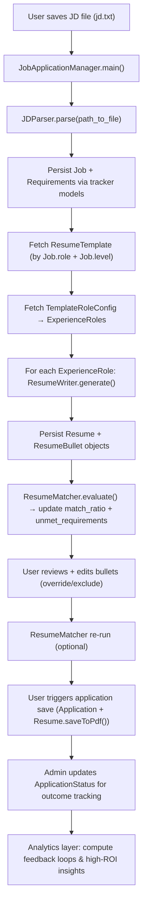

# Job Search Automation System Design

## Overview
The Job Search Automation project automates the generation and tailoring of resumes to job descriptions (JDs).  
The system reads a JD, extracts structured requirements and metadata via an LLM, and generates role-specific bullet points aligned with selected experience templates.  
This design emphasizes modularity, configurability, and token-efficient LLM orchestration.

---

## High-Level Architecture

```
job_search_automation/ (Django Project)
├── job_search_automation/        # Django project settings, URLs, WSGI
├── resume/                       # LLM-based resume generation app
│   ├── prompts/                  # Reusable and versioned LLM prompts
│   ├── services/                 # External API clients (ClaudeClient)
│   ├── templates/                # Markdown templates per role
│   ├── utils/                    # Internal logic: ResumeWriter, JDParser
│   ├── config/                   # Role mapping, model config
├── tracker/                      # Job/application logging and analytics
│   ├── models.py                 # Job, Resume, Application
│   └── utils/                    # ApplicationLogger
├── main/                         # CLI / orchestration entrypoints (management commands or scripts)
│   └── job_application_manager.py # thin orchestrator that imports resume + tracker logic and runs end-to-end
├── db.sqlite3                    # Local data store
└── manage.py
```

---

## Core Classes and Responsibilities

| Class | Responsibility |
|-------|----------------|
| **ClaudeClient** | Wraps LLM API calls (`generate()`, `count_tokens()`), handles configuration and model defaults. |
| **ResumeWriter** | Handles LLM-driven **bullet generation** for a given experience role and requirements. |
| **JobDescriptionParser (JDParser)** | Parses JD text → extracts requirements and metadata (JSON). |
| **ApplicationLogger** | Validates metadata and stores applications/resume info in DB; triggers optional notifications. |
| **JobApplicationManager** | Orchestrator CLI/entrypoint: invokes JDParser, calls ResumeWriter for bullets, persists Job/Requirement/Resume/ResumeBullet via tracker models, and manages iterative match/repair flows. |
| **JobApplicationManager** | Orchestrates the entire flow: fetch JD, parse JD, generate resume, log application. |
| **Resume (model methods)** | Responsible for on-demand rendering: `_generate()` (assemble template + bullets), `saveToMarkdown()`, `saveToPdf()` — these use persisted models to render output when called. |
| **ResumeMatcher** | LLM-assisted utility that, given a job's requirements and the current resume (bullets), returns which requirements are met/missing and enables iterative improvement of `match_ratio`. |

---

## Functional Requirements

### JD Ingestion
- Read JD from a local file (e.g., `jd.txt`).
- Normalize and clean text.

### Requirements & Metadata Extraction
- Make LLM API call.
- Return structured JSON:

```
{
   "metadata": {
      "company": "Meta",
      "listing_job_title": "Software Engineer",
      "role": "Software Engineer",
      "work_setting": "Remote"
   },
   "requirements": [
         {
            "text": "Strong Python skills",
            "keywords": ["Python"], 
            "relevance": 0.9
         }
   ]
}
```

### Template Handling
- Maintain Markdown templates for multiple roles in `resume/templates/`.  
- Template selection is driven by `ResumeTemplate` + the `TemplateRoleConfig` rows (use `template.role_configs` to find which `ExperienceRole`s to include and the configured `max_bullet_count` per role).  
- The orchestrator / resume-renderer should fetch `ResumeTemplate`, then `template.role_configs.filter(include=True).order_by(...)` to determine role order and bullet counts for generation and rendering.

### Bullet Generation

#### Previous (Complex) Design
- One LLM call per requirement.
- Shared state between calls to maintain context.
- Complex pruning, deduplication, and weighted scoring.
- Token-heavy and required rate limiting.

#### Current (Simplified Per-Role) Design
- One LLM call per **experience role**, not per requirement.
- Input: all requirements (sorted by relevance) + experience details for one role.
- Output: up to *N* bullets (preconfigured) for that role.

This approach:
- Keeps input well under the per-request token limit.
- Avoids rate limiting due to fewer calls.
- Produces consistent bullet counts and relevance.
- Simplifies orchestration while maintaining strong quality control.

### Output Generation
- Save Markdown resume.
- Optional PDF conversion.
- Maintain versioning.

### Application Logging
- Store JD metadata, extracted requirements, and generated resume info.
- Validate and persist via Django ORM.

---

## Data Model Design

### App and Model Organization

To maintain modularity between the resume-generation domain and the job-tracking domain, models are distributed across **domain-specific Django apps** rather than centralized in one location. This structure supports future growth (e.g., adding analytics or orchestration apps) without creating coupling between unrelated domains.

| App | Domain | Core Models | Responsibility |
|------|---------|--------------|----------------|
| **resume** | Resume generation | `ResumeTemplate`, `TemplateRoleConfig`, `Resume`, `ResumeBullet`, `ExperienceRole`, `ExperienceProject` | Manages templates, experience data, and generated resume artifacts. |
| **tracker** | Job and application tracking | `Job`, `Requirement`, `ContractJob`, `Application`, `ApplicationStatus` | Manages job postings, parsed requirements, applications, and status updates. |

**Rationale:**
- Keeps resume logic independent from job tracking logic.
- Enables modular testing and database migrations.
- Supports clean orchestration via `JobApplicationManager`, which coordinates both domains.
- Allows new domain apps (e.g., analytics, orchestration) to be added without refactoring existing models.

**Cross-App Relationships:**
- The `Resume` model references `tracker.Job` (via FK) since resumes are generated for specific jobs.
- Cross-app foreign keys are defined using the `app_label.ModelName` convention, e.g.:

    ```python
    job = models.ForeignKey("tracker.Job", on_delete=models.CASCADE)
    ```

**Model Organization:**
Each app uses a `models/` directory instead of a single `models.py` file, improving maintainability and clarity as the model layer expands.

```
resume/
  models/
    resume.py
    resume_bullet.py
    resume_template.py
    experience_role.py
    template_role_config.py

tracker/
  models/
    job.py
    requirement.py
    application.py
    application_status.py
```

Each directory includes an `__init__.py` file that imports all model classes, enabling simple imports throughout the codebase (e.g., `from resume.models import Resume`).

### Core Models

#### Job
| Field | Type | Description |
|--------|------|-------------|
| id | IntegerField | Primary key |
| company | CharField | Company name |
| listing_job_title | CharField | Title from job description |
| role | CharField | Job role |
| specialization | CharField | Optional specialization |
| level | CharField | Level designation |
| location | CharField | Job location |
| work_setting | CharField | Work setting |
| min_experience_years | PositiveIntegerField | Minimum years of experience |
| min_salary | IntegerField | Minimum salary |
| max_salary | IntegerField | Maximum salary |

#### ContractJob
| Field | Type | Description |
|-------|------|-------------|
| id | int | Primary key |
| job_id | FK(Job) | Base job this contract role is associated with |
| consulting_company | CharField | Optional consulting company through which the contract is offered |
| contract_length_months | PositiveIntegerField | Duration of the contract in months |
| hourly_rate | FloatField | Hourly pay rate for the contract |
| provides_benefits | BooleanField | Whether the contract provides benefits |
| provides_pto | BooleanField | Whether the contract provides paid time off |

#### Requirement
| Field | Type | Description |
|--------|------|-------------|
| id | IntegerField | Primary key |
| job_id | FK(Job) | Source JD |
| text | TextField | Requirement text |
| relevance | FloatField | Relevance score (0–1, higher means more important) |

#### ResumeTemplate
| Field | Type | Description |
|--------|------|-------------|
| id | IntegerField | Primary key |
| target_role | CharField | e.g., "Software Engineer" |
| target_level | CharField | e.g., "II" |
| template_path | CharField | Path to Markdown template |

#### Resume
| Field | Type | Description |
|--------|------|-------------|
| id | IntegerField | Primary key |
| template_id | FK(ResumeTemplate) | Which template was used |
| job_id | FK(Job) | Job description source |
| unmet_requirements | CharField | CSV string of unmatched tools/technologies (e.g., "Go,Ruby on Rails") |
| match_ratio | FloatField | (Met requirements / total requirements) |

#### ResumeBullet
| Field | Type | Description |
|--------|------|-------------|
| id | IntegerField | Primary key |
| resume | FK(Resume) | Associated resume |
| order | IntegerField | Display order |
| text | TextField | Bullet content |
| exclude | BooleanField | Whether to exclude this bullet from the generated resume |
| override_text | TextField | Optional manually edited version of the bullet that takes priority over `text` |

#### ExperienceRole
| Field | Type | Description |
|--------|------|-------------|
| id | IntegerField | Primary key |
| key | CharField | Stable identifier used by templates (e.g., "navit_swe", "amazon_sde") |
| company | CharField | Employer name (e.g., "Nav.it") |
| title | CharField | Job title (e.g., "Software Engineer") |
| display_name | CharField | Optional human-facing name; if null, render as `title – company` |

#### ExperienceProject
| Field | Type | Description |
|--------|------|-------------|
| id | IntegerField | Primary key |
| experience_role | FK(ExperienceRole) | Associated role |
| short_name | CharField | Short label for the project/task |
| problem_context | TextField | Short problem statement (concise) |
| actions | CharField | CSV string of action items (e.g., "implemented X, rewrote Y") |
| tools | CharField | CSV string of tools/technologies (e.g., "Django,Postgres") |
| outcomes | CharField | CSV string of short outcomes (e.g., "reduced latency 80%") |
| impact_area | CharField | e.g., "Performance Optimization", "User Engagement" |

#### TemplateRoleConfig
| Field | Type | Description |
|--------|------|-------------|
| id | IntegerField | Primary key |
| template | FK(ResumeTemplate) | Which template |
| experience_role | FK(ExperienceRole) | Which experience role |
| include | BooleanField | Whether to include this role in this template |
| max_bullet_count | PositiveIntegerField | Max number of bullets to generate for this role |

#### Application
| Field | Type | Description |
|--------|------|-------------|
| id | IntegerField | Primary key |
| applied_date | DateField | When application was submitted |
| resume_id | FK(Resume) | Resume used |
| job_id | FK(Job) | Job applied to |
| status | FK(ApplicationStatus) | Latest known status |

#### ApplicationStatus
| Field | Type | Description |
|--------|------|-------------|
| id | IntegerField | Primary key |
| state | CharField | Application state (e.g., rejected, callback, closed, etc.) |
| application_id | FK(Application) | Associated application |
| status_date | DateField | When the event occurred or was recorded |

---

### End-to-End Flow Diagram



---

## Design Decisions & Tradeoffs

See [Tradeoffs](./tradeoffs.md)

---

## Incremental Build Plan

Incremental Build Plan

| Phase | Focus | Output |
|--------|--------|---------|
| [x] Phase 1 | Django project + resume app setup | Working environment |
| [x] Phase 2 | JD extraction (metadata + requirements) | JSON output |
| [ ] Phase 3 | Template selection | Correct Markdown template (TemplateRoleConfig-based) |
| [ ] Phase 4 | Bullet generation loop | Persisted Resume + ResumeBullet entries |
| [ ] Phase 5 | Resume rendering | `_generate()` + `saveToMarkdown()` / `saveToPdf()` |
| [ ] Phase 6 | Iterative match utility | `ResumeMatcher` to evaluate & improve `match_ratio` |
| [ ] Phase 7 | tracker app expansion | End-to-end automation, analytics, dashboards |

---

## Future Enhancements
- Iterative Match Workflow: add `ResumeMatcher` (LLM-assisted) to enable on-demand evaluation of which requirements are satisfied, drive iterative `ExperienceProject` additions/overrides, and update `match_ratio`.
- Batch generation for multiple JDs.
- Resume feedback analytics: correlate application outcomes (rejected/callback) with resume features (match_ratio, template, overrides) to identify high-ROI targets and guide generation improvements. 
- Analytics/Dashboarding

---
