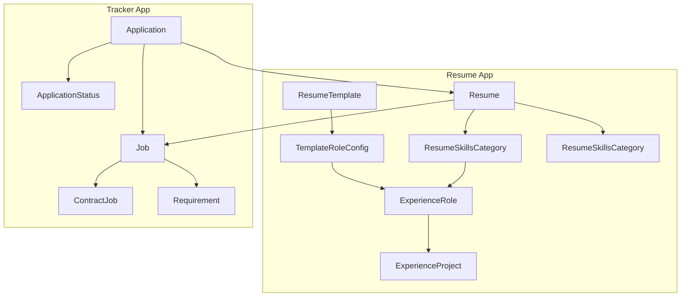
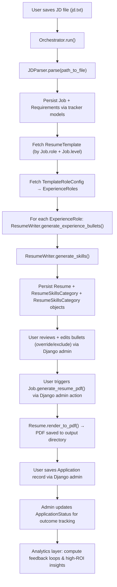

# Job Search Automation System Design

## Overview
The Job Search Automation project automates the generation and tailoring of resumes to job descriptions (JDs).  
The system reads a JD, extracts structured requirements and metadata via an LLM, and generates role-specific experience bullet points and skills aligned with selected experience templates.  
This design emphasizes modularity, configurability, and token-efficient LLM orchestration.

---

## High-Level Directory Structure

```
job_search_automation/ (Django Project)
├── job_search_automation/        # Django project settings, URLs, WSGI
├── resume/                       # LLM-based resume generation app
│   ├── models/                   # Models for persisting resume data
│   ├── prompts/                  # Reusable and versioned LLM prompts
│   ├── schemas/                  # Pydantic schemas for validating all LLM outputs
│   ├── services/                 # ResumeWriter, JDParser
│   ├── clients/                  # External API clients (ClaudeClient)
│   ├── templates/                # HTML templates per role
│   └── utils/                    # Shared helpers for the app (prompt manipulation, validation, content builders)
├── tracker/                      # Job/application logging and analytics
│   ├── models/                   # Models for persisting job and application data
├── orchestration/                # CLI / orchestration entrypoints (management commands or scripts)
│   ├── orchestrator.py           # thin Orchestrator that imports resume + tracker logic and runs end-to-end
│   ├── management/commands/      # CLI commands / Django commands (run_orchestrator.py)
├── db.sqlite3                    # Local data store
└── manage.py
```

---

## Core Classes and Responsibilities

| Class | Responsibility |
|-------|----------------|
| **ClaudeClient** | Wraps LLM API calls (`generate()`, `count_tokens()`), handles configuration and model defaults. |
| **ResumeWriter** | Handles LLM-driven **bullet generation** for a given experience role and requirements; includes `generate_experience_bullets()` and `generate_skills()` to produce both experience and skill-section entries used by `Resume` rendering. |
| **JDParser (JDParser)** | Parses JD text → extracts requirements and metadata (JSON). |
| **Orchestrator** | Orchestrator CLI/entrypoint: invokes JDParser, calls ResumeWriter for bullets, persists Job/Requirement/Resume/ResumeBullet via tracker models, and manages iterative flows. |
| **Job (model methods)** | `generate_resume_pdf()` — entry point for on-demand PDF generation via Django admin; delegates to `Resume.render_to_pdf()` for actual rendering. |
| **Resume (model methods)** | `render_to_pdf()` — assembles template with bullets and skills, renders HTML via Jinja2, converts to PDF via WeasyPrint. |

---

## Functional Requirements

### JD Ingestion
- Read JD from a local file (e.g., `jd.txt`).
- Normalize and clean text.

### Requirements & Metadata Extraction
- Make LLM API call.
- Return structured JSON:
- **Validate the returned JSON against the `JDModel` Pydantic schema** to ensure the response adheres to expected types and structure before persisting to the database. Any validation failure halts the flow and surfaces a descriptive error.


```
{
   "metadata": {
      "company": "Meta",
      "listing_job_title": "Software Engineer",
      "role": "Software Engineer",
      "work_setting": "Remote"
   },
   "requirements": [
         {
            "text": "Strong Python skills",
            "keywords": ["Python"], 
            "relevance": 0.9
         }
   ]
}
```

### Template Handling

**Technology Stack:**  
Resume templates use **HTML + CSS + Jinja2**, rendered to PDF via **WeasyPrint**.

**Rationale:**  
- **HTML + CSS** provides precise control over typography (font family, sizes, bold, spacing) required for professional resume formatting.  
- **Jinja2** enables template inheritance and variable substitution, supporting DRY principles (base template for static content, child templates for variations).  
- **WeasyPrint** reliably converts HTML + CSS to PDF with predictable rendering.

**Template Structure:**  
- **Base template** (`base.html`): Contains static content (name, contact info, education) and defines Jinja2 blocks for dynamic sections (experience, skills).  
- **Child templates** (e.g., `engineer.html`): Extend base template and override blocks with role-specific content.  
- **CSS stylesheet** (`resume.css`): Defines all visual styling (Calibri font, 20pt name, 14pt section headers, 12pt experience titles, 11pt bullets, spacing, margins).

**Template Selection:**  
- Template selection is driven by `ResumeTemplate` + the `TemplateRoleConfig` rows.  
- Use `template.role_configs.filter().order_by("order")` to determine which `ExperienceRole`s to include and the configured `max_bullet_count` per role.  
- The orchestrator fetches the appropriate HTML template based on `Job.role` and `Job.level`, then renders it with Jinja2 using data from `Resume`, `ResumeSkillsCategory`, and `ResumeSkillsCategory` models.

**Rendering Pipeline:**  
1. User triggers PDF generation via Django admin action on a `Job` record.
2. `Job.generate_resume_pdf()` fetches associated `Resume` and delegates to `Resume.render_to_pdf()`.
3. `Resume.render_to_pdf()` fetches `ResumeTemplate` and associated `TemplateRoleConfig` entries.
4. Query `ResumeSkillsCategory` and `ResumeSkillsCategory` objects (filtered by `exclude=False`), using `override_text` if present, otherwise `text`.
5. Render HTML template with Jinja2, injecting roles (using `title_override` if present), bullets and skills.
6. Pass rendered HTML + CSS to WeasyPrint for PDF generation.
7. Save output file with naming convention based on job details (e.g., `{company}_{listing_job_title}_{level}.pdf`).

**Template Directory Structure:**  
```
resume/
  templates/
    html/
      base.html                      # Base template with static content
      analyst.html                   # Child template for analyst roles
      engineer.html                  # Child template for engineer roles
    css/
      compact.css                    # Stylesheet with compact properties
      standard.css                   # Stylesheet with standard properties
```

**Benefits:**  
- **Separation of concerns:** Content (HTML), style (CSS), and data (models) are cleanly separated.  
- **Maintainability:** Changes to styling require only CSS edits; structural changes are isolated to HTML templates.  
- **Reusability:** Base template eliminates duplication of static content across role-specific templates. 

### Bullet Generation

#### Previous (Complex) Design
- One LLM call per requirement.
- Shared state between calls to maintain context.
- Complex pruning, deduplication, and weighted scoring.
- Token-heavy and required rate limiting.

#### Current (Simplified Per-Role) Design
- One LLM call per **experience role**, not per requirement.
- Input: all requirements (sorted by relevance) + experience details for one role.
- Output: up to *N* bullets (preconfigured) for that role.
- **All bullet-generation responses are also validated with Pydantic models** before any ORM persistence, ensuring schema correctness and safe downstream usage.

This approach:
- Keeps input well under the per-request token limit.
- Avoids rate limiting due to fewer calls.
- Produces consistent bullet counts and relevance.
- Simplifies orchestration while maintaining strong quality control.
- Ensures validated, structured outputs for downstream persistence.

### Output Generation
- Generate PDF on-demand via Django admin action.
- Trigger PDF generation through `Job.generate_resume_pdf()`.
- Maintain versioning.

### Application Logging
- Store JD metadata, extracted requirements, and generated resume info.
- Validate and persist via Django ORM.

---

## Validation Layer

All LLM outputs—whether from **JDParser** (requirements extraction) or **ResumeWriter** (bullet generation)—undergo **schema validation via Pydantic** before any persistence or downstream processing.

### Purpose
- Guarantee structured and type-safe data flowing into the Django model layer.
- Catch malformed or incomplete LLM responses early, with clear developer-facing error messages.
- Standardize validation logic across all services interacting with the LLM.

### Implementation Summary
- Each LLM service defines its corresponding Pydantic schema (e.g., `JDModel`, `BulletListModel`).
- Validation occurs immediately after receiving LLM output and before ORM operations.
- Validation failures raise descriptive exceptions to prevent silent data corruption or inconsistent states.

This validation step is mandatory across all LLM-integrated modules.

---

## LLM Cost Strategy

LLM cost management is a core part of the system's architecture due to the multi-step pipeline (parsing → generation).  
Rather than embedding all details in this design document, a dedicated reference is provided in [`llm_cost_strategy.md`](./llm_cost_strategy.md).

At a high level, the system's **cost control principles** are:
- Use **per-role batching** for predictable and token-efficient bullet generation.
- Express requirements as **short phrases** instead of full sentences.
- Estimate and log token usage before every call using `ClaudeClient.count_tokens()`.
- Default to **Claude 4.5 Sonnet**, with optional support for cheaper models for auxiliary tasks.
- Manually preprocess JDs to exclude irrelevant sections for reduced input size.

For detailed strategies, pricing breakdowns, and future optimization levers, see **`llm_cost_strategy.md`**.

---

## Data Model Design

### App and Model Organization

To maintain modularity between the resume-generation domain and the job-tracking domain, models are distributed across **domain-specific Django apps** rather than centralized in one location. This structure supports future growth (e.g., adding analytics or orchestration apps) without creating coupling between unrelated domains.

| App | Domain | Core Models | Responsibility |
|------|---------|--------------|----------------|
| **resume** | Resume generation | `ResumeTemplate`, `TemplateRoleConfig`, `Resume`, `ResumeSkillsCategory`, `ResumeSkillsCategory`, `ExperienceRole`, `ExperienceProject` | Manages templates, experience data, and generated resume artifacts. |
| **tracker** | Job and application tracking | `Job`, `Requirement`, `ContractJob`, `Application`, `ApplicationStatus` | Manages job postings, parsed requirements, applications, and status updates. |

**Rationale:**
- Keeps resume logic independent from job tracking logic.
- Enables modular testing and database migrations.
- Supports clean orchestration via `Orchestrator`, which coordinates both domains.
- Allows new domain apps (e.g., analytics, orchestration) to be added without refactoring existing models.

**Cross-App Relationships:**
- The `Resume` model references `tracker.Job` (via FK) since resumes are generated for specific jobs.
- Cross-app foreign keys are defined using the `app_label.ModelName` convention, e.g.:

    ```python
    job = models.ForeignKey("tracker.Job", on_delete=models.CASCADE)
    ```

**Model Organization:**
Each app uses a `models/` directory instead of a single `models.py` file, improving maintainability and clarity as the model layer expands.

```
resume/
  models/
    resume.py
    resume_role_bullet.py
    resume_skills_category.py
    resume_template.py
    experience_role.py
    template_role_config.py

tracker/
  models/
    job.py
    requirement.py
    application.py
    application_status.py
```

Each directory includes an `__init__.py` file that imports all model classes, enabling simple imports throughout the codebase (e.g., `from resume.models import Resume`).

### Models by Domain Diagram


### Core Models

#### Job
| Field | Type | Description |
|--------|------|-------------|
| id | IntegerField | Primary key |
| company | CharField | Company name |
| listing_job_title | CharField | Title from job description |
| role | CharField | Job role |
| specialization | CharField | Optional specialization |
| level | CharField | Level designation |
| location | CharField | Job location |
| work_setting | CharField | Work setting |
| min_experience_years | PositiveIntegerField | Minimum years of experience |
| min_salary | IntegerField | Minimum salary |
| max_salary | IntegerField | Maximum salary |

#### ContractJob
| Field | Type | Description |
|-------|------|-------------|
| id | int | Primary key |
| job_id | OneToOne(Job) | Base job this contract role is associated with |
| consulting_company | CharField | Optional consulting company through which the contract is offered |
| contract_length_months | PositiveIntegerField | Duration of the contract in months |
| hourly_rate | FloatField | Hourly pay rate for the contract |
| provides_benefits | BooleanField | Whether the contract provides benefits |
| provides_pto | BooleanField | Whether the contract provides paid time off |

#### Requirement
| Field | Type | Description |
|--------|------|-------------|
| id | IntegerField | Primary key |
| job_id | FK(Job) | Source JD |
| text | TextField | Requirement text |
| relevance | FloatField | Relevance score (0–1, higher means more important) |

#### ResumeTemplate
| Field | Type | Description |
|--------|------|-------------|
| id | IntegerField | Primary key |
| target_role | CharField | e.g., "Software Engineer" |
| target_level | CharField | e.g., "II" |
| target_specialization | CharField | Optional specialization (e.g., "Backend", "Python") |
| template_path | CharField | Path to HTML template |
| style_path | CharField | Path to CSS stylesheet |

#### Resume
| Field | Type | Description |
|--------|------|-------------|
| id | IntegerField | Primary key |
| template_id | FK(ResumeTemplate) | Which template was used |
| job_id | OneToOne(Job) | Job description source |

#### ResumeRole
| Field | Type | Description |
|--------|------|-------------|
| id | IntegerField | Primary key |
| resume | FK(Resume) | Associated resume |
| experience_role | FK(ExperienceRole) | Original experience role used as source |
| title | CharField | Frozen title used in this resume (copied from override_title or experience_role.title) |
| order | IntegerField | Display order of this role within the resume |

#### ResumeRoleBullet
| Field | Type | Description |
|--------|------|-------------|
| id | IntegerField | Primary key |
| resume_role | FK(ResumeRole) | Parent role context |
| order | IntegerField | Display order within the role |
| text | TextField | Generated bullet text |
| override_text | TextField | Optional manual edit overriding `text` |
| exclude | BooleanField | Whether to exclude from rendering |

#### ResumeSkillsCategory
| Field | Type | Description |
|--------|------|-------------|
| id | IntegerField | Primary key |
| resume | FK(Resume) | Associated resume |
| order | IntegerField | Display order within the resume |
| category | CharField | Category label such as "Programming Languages" or "Data & Visualization" |
| skills_text | TextField | CSV string of related skills (e.g., "Python, Java") |
| exclude | BooleanField | Whether to exclude from rendering |

#### ExperienceRole
| Field | Type | Description |
|--------|------|-------------|
| id | IntegerField | Primary key |
| key | CharField | Stable identifier used by templates (e.g., "navit_swe", "amazon_sde") |
| company | CharField | Employer name (e.g., "Nav.it") |
| title | CharField | Job title (e.g., "Software Engineer") |
| start_date | DateField | The date the role began |
| end_date | DateField | The date the role ended |
| location | CharField | Location where the role was set in. (e.g "Seattle, WA", "Remote") |

#### ExperienceProject
| Field | Type | Description |
|--------|------|-------------|
| id | IntegerField | Primary key |
| experience_role | FK(ExperienceRole) | Associated role |
| short_name | CharField | Short label for the project/task |
| problem_context | TextField | Short problem statement (concise) |
| actions | CharField | CSV string of action items (e.g., "implemented X, rewrote Y") |
| tools | CharField | CSV string of tools/technologies (e.g., "Django,Postgres") |
| outcomes | CharField | CSV string of short outcomes (e.g., "reduced latency 80%") |

#### TemplateRoleConfig
| Field | Type | Description |
|--------|------|-------------|
| id | IntegerField | Primary key |
| template | FK(ResumeTemplate) | The resume template this configuration belongs to |
| experience_role | FK(ExperienceRole) | The experience role to include in the template |
| title_override | CharField | Optional experience role title override |
| order | PositiveIntegerField | Display order for this role within the template (lower values appear first) |
| max_bullet_count | PositiveIntegerField | Maximum number of bullets to generate for this role |

#### Application
| Field | Type | Description |
|--------|------|-------------|
| id | IntegerField | Primary key |
| applied_date | DateField | When application was submitted |
| job_id | OneToOne(Job) | Job applied to |

#### ApplicationStatus
| Field | Type | Description |
|--------|------|-------------|
| id | IntegerField | Primary key |
| state | CharField | Application state (e.g., rejected, callback, closed, etc.) |
| application_id | OneToOne(Application) | Associated application |
| status_date | DateField | When the event occurred or was recorded |

#### Interview
| Field | Type | Description |
|--------|------|-------------|
| id | IntegerField | Primary key |
| application | FK(Application) | Associated application |
| stage | CharField | Interview stage (recruiter_screen, technical_screen, final_loop) |
| format | CharField | Interview format (phone_call, virtual_meeting) - optional |
| focus | CharField | Interview focus area (coding, system_design, behavioral, hiring_manager) - optional |
| interviewer_name | CharField | Name of the interviewer - optional |
| interviewer_title | CharField | Title/role of the interviewer - optional |
| scheduled_at | DateTimeField | When the interview is scheduled |

#### InterviewProcessStatus
| Field | Type | Description |
|--------|------|-------------|
| id | IntegerField | Primary key |
| application | OneToOne(Application) | Associated application (only exists if interviews happened) |
| outcome | CharField | Final interview outcome (offer, rejected, failed, ghosted, withdrew) |
| outcome_date | DateField | When the outcome occurred or was recorded |
| notes | TextField | Optional context about the outcome |

---

### End-to-End Flow Diagram



---

## Design Decisions & Tradeoffs

See [Tradeoffs](./tradeoffs.md)

---

## Incremental Build Plan

Incremental Build Plan

| Phase | Focus | Output |
|--------|--------|---------|
| [x] Phase 1 | Django project + resume app setup | Working environment |
| [x] Phase 2 | JD extraction (metadata + requirements) | JSON output |
| [x] Phase 3 | Bullet generation loop | JSON output |
| [x] Phase 4 | Skill-section generation | JSON output |
| [x] Phase 5 | Template selection | Correct HTML template (TemplateRoleConfig-based) |
| [x] Phase 6 | Resume rendering | `Job.generate_resume_pdf()` + `Resume.render_to_pdf()` |
| [x] Phase 7 | orchestration app End-to-end automation | Persisted resume + tracker models |
| [ ] Phase 8 | Analytics | dashboards: compute feedback loops & high-ROI insights |

---

## Considered and Rejected

### Post-Generation Resume Analysis

**Considered:** Automated matching of generated resumes against JD requirements to identify gaps (unmet requirements) and calculate match ratios for analytics.

**Rejected because:**
- Requires full JD text + full resume context for reliable evaluation (high token cost)
- LLM determination of "requirement met" is subjective and inconsistent across models/runs
- Diminishing returns once experience input data is complete—unmet requirements eventually reflect genuine lack of experience rather than generation gaps
- Manual JD review before generation is more effective for identifying input data gaps
- Analytics unlikely to yield meaningful insights due to high-match clustering (only applying to qualified jobs)
- Data is persisted and can be backfilled later if a concrete use case emerges

**Alternative:** Periodically pass full JD + generated resume to ChatGPT with manual prompt for spot-check gap analysis and improvement suggestions.

---

## Future Enhancements
- Batch generation for multiple JDs.
- *Resume feedback analytics:* correlate application outcomes (rejected/callback) with resume features (template, overrides) to identify high-ROI targets and guide generation improvements. 
- Analytics/Dashboarding
- **General and Company-Tailored Resume Modes:**
  - *General Target Role Resume:* Generate a "framed" resume for a target role (e.g., *Data Engineer*) when limited or no requirements are provided — such as when a recruiter message lacks a full JD. The system leverages the role-specific template and weighted prior experience configurations to infer likely requirements and produce a strong generic framing.
  - *Company-Tailored Resume:* Generate resumes explicitly aligned with a company's known leadership principles or values (e.g., Amazon LPs, Meta Leadership). This mode enriches bullet phrasing and ordering to reflect organizational priorities without requiring a full job description.
- **Model Flexibility and Benchmarking:**
  - Introduce configurable model selection to allow using different LLM providers (e.g., Anthropic, OpenAI) and versions (e.g., `claude-sonnet-4-5`, `claude-haiku-4-5`, `gpt-4.1`, etc.).
  - Support per-utility model selection so that modules can use optimal models for their complexity:
    - Example: more context-heavy tasks (e.g., `generate_experience_bullets()`) may use higher-capacity models like `claude-sonnet-4-5`.
    - Example: `generate_skills()` may use a faster, cheaper model like `claude-haiku-4-5`.
  - Implement a benchmarking and metrics layer to track model **cost**, **latency**, and **output quality** (e.g., validation success rate, token usage).
  - Aggregate and visualize results to guide model selection decisions and cost-performance optimization over time.

---